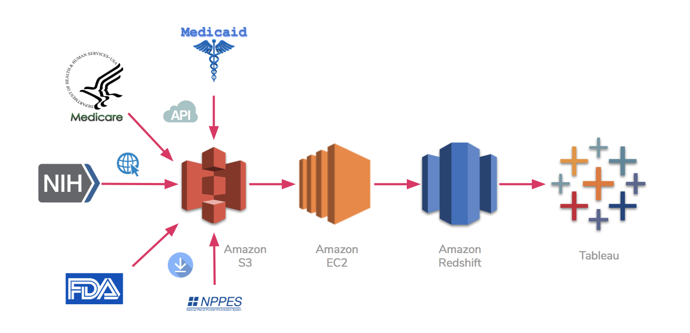
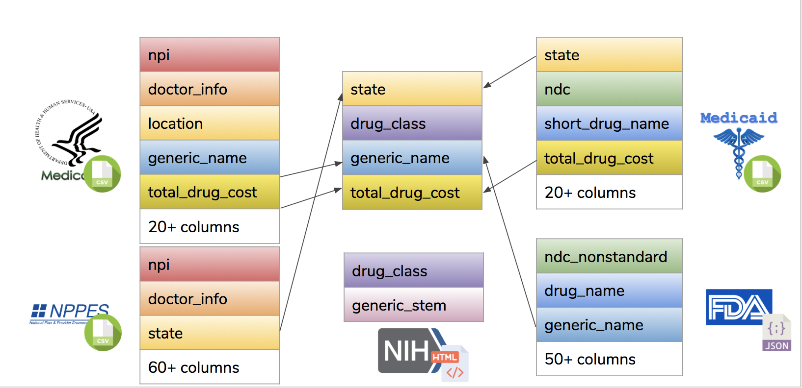

# RxMiner
2019 Insight Data Engineering Project

## Overview
Nowadays, doctors and nursing houses are switching to the electronic prescribing system, which allows the prescription drugs usage data to be collected by healthcare and insurance companies. Massive prescription drug datasets are available to public or by requests, and pharmaceutical companies could use them to develop marketing strategies or drug products accordingly.

However, there are millions of drugs in the market. And since doctors have their own way to write the prescription and providers use different business rules to collect and provide datasets, these datasets are messy and non-standardized. The medicare datasets are prepared by federal so they contain inaccurate state information and outdated doctor’s information. The medicaid datasets uses non-standardized drug code to represent the drug prescribed and they truncated drug names for storing purpose.

If we apply these datasets directly in the further analysis, we would run into errors. Thus, I use datasets from other sources to validate and clean the drug prescription dataset, applying them with the proper business rules, flagging the suspicious data and putting them into proper groups. Thus we could have a comprehensive review of all drug usages in different classes over the states.

[Slides](https://docs.google.com/presentation/d/1z6SpBYRWqAIjsW7Khf0E44y8RqzUDVtGs8ziCrJ-xoA)

## Pipeline


I collected datasets from multiple sources and stored them in Amazon S3. Then I validate and transform the datasets and stage the cleaned datasets in Redshift and join them. Then I used Tableau to visualize the analysis.

### Import
Raw data were collected from multiple sources using three methods and stored in a S3 bucket.

1. Web crawler
`import/rxnorm_import.py`
I used regex pattern `<a\s*href=[\'|"](.*?/kss/rxnorm/RxNorm_full_\d+.zip)[\'|"]>` to find all RxNorm zip files and downloaded them into my S3 bucket.

`ingest/mylib/rxgen_parser.py`
I used `beautifulsoup4` to find all stem names except for those in a subgroup and converted the stem name into regex patterns and stored in a dictionary for future usage.

2. API
`import/soda_import.py`
I used SODA API to download Medicare and Medicaid datasets from Socrata database and stored them in my S3 bucket.

3. From other S3 bucket
I created and attached a policy to allow `getObject` request on `arn:aws:s3:::download.open.fda.gov` on my IAM group and copyed national drug code data from FDA's S3 bucket using `aws s3 cp`.

### Ingest
- `ingest/medicaid_ingest.py`
I ingested healthcare datasets from Medicaid and read them chunk by chunk. National Drug Codes (NDC) were standardized while processing. The data table was staged in Redshift as `sdud`.

- `ingest/medicare_ingest.py`
I ingested healthcare datasets from Medicare and read them chunk by chunk. The data table was staged in Redshift as `pupd`.

I use a seperate script to parse through Medicare datasets and collect unique generic names and classify the drugs by regex patterns. This table was staged in Redshift as `pupd_genclass`.

- `ingest/docinfo_ingest.py`
I ingested and cleaned National Providers Identification (NPI) datasets chunk by chunk. Postal code and practice state information were cleaned while processing. The data table was staged in Redshift as `npidata`.

- `ingest/druginfo_ingest.py`
I ingested and cleaned FDA's drug database. NDC were standardized while processing. The data table was staged in Redshift as `ndc9` (generic name specific) and `ndc11` (packaging specific). I also classify drugs by each unique generic names and staged the table in Redshift as `genclass`.

- `ingest/mylib/rxgen_parser.py`
I used `beautifulsoup4` to find all stem names except for those in a subgroup and converted the stem name into regex patterns and stored in a dictionary for future usage.

### Database
- `ingest/mylib/db_connec.py`
`sqlalchemy` and `sqlalchemy-redshift` were used as the ODBC connector for PostgreSQL and Redshift, respectively.

- `ingest/mylib/glob_func.py`
I saved the dataframe into `.csv` file in memory (for PostgreSQL) or S3 bucket (for Redshift) and buck copy the table into PostgreSQL or Redshift to increase the saving speed.

### SQL


The healthcare datasets from medicaid and medicare were first validated by npi (doctor's information) and ndc (drug's information). Drug events failed the validation were collected in the `error` table.

Four columns (`state`, `drug_class`, `generic_name` and `total_drug_cost`) were joined for the national drug usage analysis.

`psycopg2` were used as ODBC connector.

### Visualization
I used `Tableau Desktop 2018.3` to prepare the visualization of national drug usage during 2013-2016 and published the project on [Tableau public server](https://public.tableau.com/profile/runhan.yu#!/vizhome/rxminer2/Dashboard1).

I also embedded the dashboard in a [static webpage](http://rxminer.net) written prepared using bootstrap.

## Configuration
Raw data were collected and stored in S3 bucket.
```
.
├── npi
│   ├── npidata_pfile_20050523-20190113.csv
│   ├── npidata_pfile_20050523-20190113_FileHeader.csv
│   └── NPPES_Data_Dissemination_CodeValues.pdf
├── openfda
│   ├── drug-ndc-0001-of-0001.json.zip
│   └── ndc_schema.json
├── pupd
│   ├── medicare_pupd_2013.csv
│   ├── medicare_pupd_2014.csv
│   ├── medicare_pupd_2015.csv
│   └── medicare_pupd_2016.csv
├── rxnorm
│   ├── 01022008.zip
│   ├── 01022018.zip
│   ├── ...
│   ├── 12092005.zip
│   └── 12212006.zip
└── sdud
    ├── medicaid_sdud_2013.csv
    ├── medicaid_sdud_2014.csv
    ├── medicaid_sdud_2015.csv
    └── medicaid_sdud_2016.csv
```
The jobs were run on a `m4.4xlarge` EC2 instance.
The Redshift database was created in Amazon Redshift.
The PostgreSQL database was created in Amazon RDS.

## Dependencies
```
Python              2.7.12
beautifulsoup4      4.4.1
boto                2.49.0
boto3               1.9.86
botocore            1.12.86
certifi             2018.11.29
chardet             3.0.4
cvxopt              1.1.4
cycler              0.9.0
decorator           4.0.6
docutils            0.14
elementpath         1.1.3
enum34              1.1.6
futures             3.2.0
gyp                 0.1
html5lib            0.999
idna                2.8
jdcal               1.0
jmespath            0.9.3
joblib              0.9.4
lxml                3.5.0
matplotlib          1.5.1
meld3               1.0.2
nose                1.3.7
numexpr             2.4.3
numpy               1.11.0
openpyxl            2.3.0
pandas              0.17.1
patsy               0.4.1
Pillow              3.1.2
pip                 19.0.1
psycopg2            2.7.7
psycopg2-binary     2.7.7
py                  1.4.31
pyparsing           2.0.3
pytest              2.8.7
python-dateutil     2.4.2
pytz                2014.10
requests            2.21.0
s3fs                0.2.0
s3transfer          0.1.13
scipy               0.17.0
setuptools          20.7.0
simplejson          3.8.1
six                 1.10.0
SQLAlchemy          1.2.17
sqlalchemy-redshift 0.7.3
statsmodels         0.6.1
supervisor          3.2.0
tables              3.2.2
urllib3             1.24.1
wheel               0.29.0
xlrd                0.9.4
xlwt                0.7.5
xmljson             0.2.0
xmlschema           1.0.9
xmltodict           0.11.0
```
